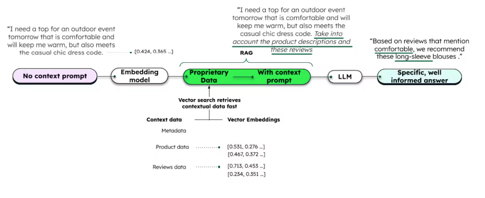
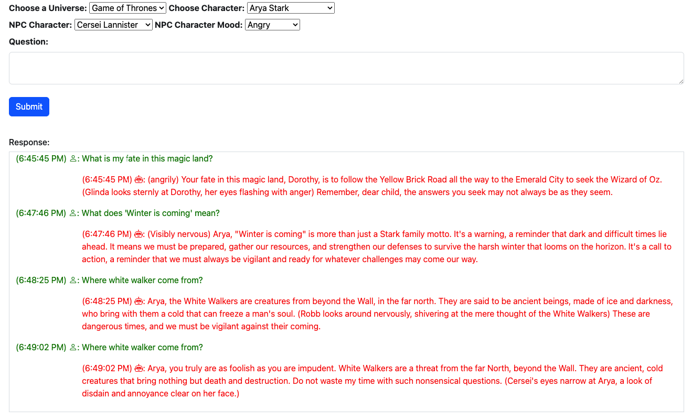

# RAG-for-NPC-Game-Characters

#### We use Basic RAG architecture in this project 

#### Demo UI

### Sample questions
#### Wizard of Oz
- What is my fate in this magic land?
-  Who was Bog?
- Who did Dorothy meet in the cornfield the next day?
- How did Dorothy help the Scarecrow?
- Why does the Scarecrow go to Oz with Dorothy?
- What is the one thing that the Scarecrow is afraid of?

#### Game of Thrones
- Who is King of the North?
- Where white walker come from?
- What does 'Winter is coming' mean?

### Dataset
- [Game of Thrones Corpus](https://drive.google.com/drive/folders/1l6BKRFaOexzKYiVJx_NT8U42rHI0c324?usp=sharing)
- [Wizard of Oz Corpus](https://drive.google.com/drive/folders/1xd8Yu_8l1La3771o1cJWsAnSGz5yadmB?usp=sharing)